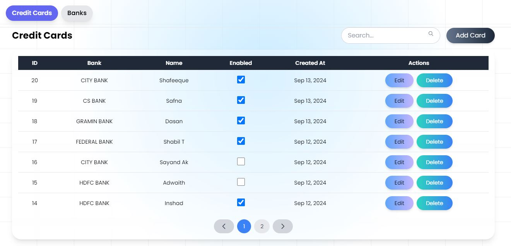

# Credit Card Dashboard

## Overview

This project is a simple admin dashboard designed to manage credit cards. It provides functionalities to view, add, update, and delete credit card information. The dashboard is built with a React frontend and an Express backend, with data stored in a MySQL database.

## Features

- **View Credit Cards**: Display a list of credit cards with pagination and search functionality.
- **Add Credit Cards**: Add new credit card entries to the database.
- **Update Credit Cards**: Edit existing credit card details.
- **Delete Credit Cards**: Remove credit card entries from the database.

## Technologies Used

- **Frontend**: React.js with TypeScript and TailwindCSS for styling
- **Backend**: Express.js with TypeScript for the server and API endpoints
- **Database**: MySQL for storing credit card data

## Project Setup

### Clone the Repository

To get started, clone the repository:

```bash
git clone https://github.com/shabil15/credit-cards-dashboard.git credit-dashboard
```

### Backend Setup

1. Navigate to the backend directory:

   ```bash
   cd credit-dashboard/backend
   ```

2. Install the required npm packages:

   ```bash
   npm install
   ```

3. Create a `.env` file in the `backend` directory and add your database details:

   ```env
   DB_HOST=127.0.0.1
   DB_USER=root
   DB_PASSWORD=
   DB_NAME=credits_dashboard
   DB_PORT=
   PORT = 8000
   ```

4. Set up the MySQL database:
   - Create the Database:
     ```sql
     CREATE DATABASE credits_dashboard;
     USE credits_dashboard;
     ```
   - Create the CreditCards Table:
     ```sql
CREATE TABLE credit_cards (
    id SERIAL PRIMARY KEY,
    bank_name VARCHAR(255),
    card_name VARCHAR(255),
    enabled BOOLEAN,
    created_at TIMESTAMP DEFAULT CURRENT_TIMESTAMP
);
     ```

5. Run the backend server:

   ```bash
   npm run dev
   ```

### Frontend Setup

1. Navigate to the frontend directory:

   ```bash
   cd credit-dashboard/frontend
   ```

2. Install the required npm packages:

   ```bash
   npm install
   ```

3. Start the frontend development server:

   ```bash
   npm run dev
   ```

4. Open your browser and visit `http://localhost:5173` to view the dashboard.

## Usage

- **Dashboard Interface**: Once the frontend server is running, you can access the dashboard in your web browser. Use the provided UI to manage credit card entries.
- **API Endpoints**: The backend provides endpoints to interact with credit card data. The frontend communicates with these endpoints to perform CRUD operations.

)
